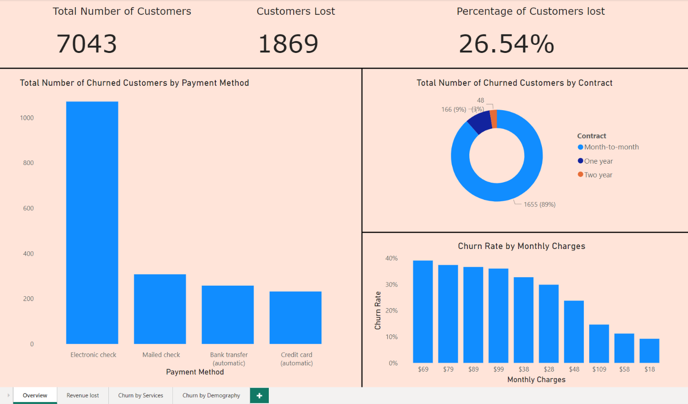
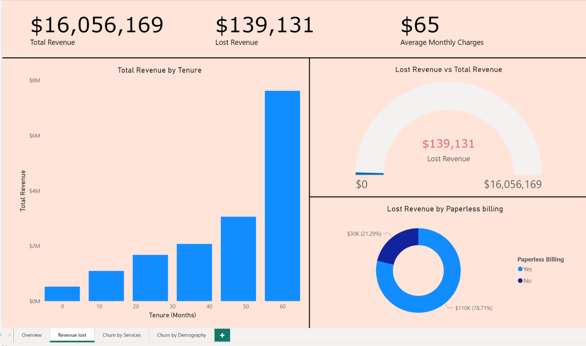
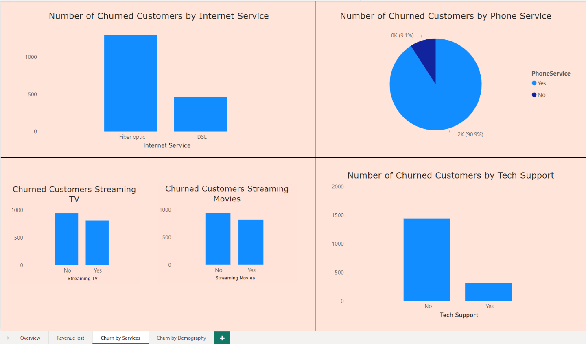
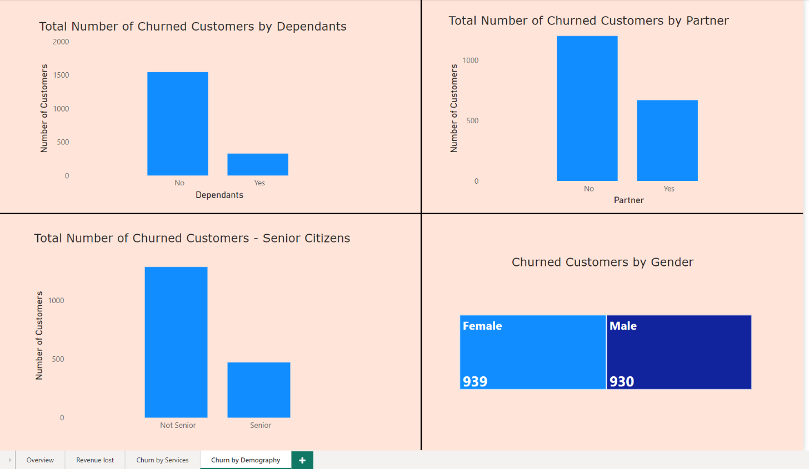

# Customer Churn Dashboard

This is a simple dashboard to look at the number and rate of people who stopped being a customer. This should help to analyse customer data and develop focused customer-retention programme.

Customer churn or customer attrition can be measured using churn rate.

Churn rate formula = (Lost Customers ÷ Total Customers at Start of Month) x 100 

  
### Data Content

Each row represents a customer, and each column contains customer’s attributes.

The data set includes information about:

Customers who left within the last month; the column is called Churn

Services that each customer has signed up for: phone, multiple lines, internet, online security, online backup, device protection, tech support, and streaming TV and movies

Customer account information: how long they’ve been a customer, contract, payment method, paperless billing, monthly charges, and total charges

Demographic info about customers: gender, age range, and if they have partners and dependents.
   

  
  
  

  
- [@victoriaoni](https://github.com/victoriaoni)
